<div align="center">

# 🔥 AE Phoenic Store

### Nền tảng thương mại điện tử cho điện thoại, máy tính bảng và phụ kiện

<p>
        
        
        
        
</p>
<p>
        
        
        
</p>

</div>

> [!IMPORTANT]
> Đây là dự án đồ án có đầy đủ luồng mua hàng, quản trị đơn hàng, voucher, thanh toán, chat và đánh giá sản phẩm.

> [!TIP]
> Muốn chạy nhanh trên máy mới? Đi thẳng đến [Cài đặt và chạy dự án](#3-cài-đặt-và-chạy-dự-án-trên-máy-khác).

<details>
<summary><strong>🌈 Bảng điều hướng nhanh</strong></summary>

- [Mục tiêu dự án](#1-mục-tiêu-dự-án)
- [Công nghệ sử dụng](#2-công-nghệ-sử-dụng)
- [Cài đặt và chạy dự án](#3-cài-đặt-và-chạy-dự-án-trên-máy-khác)
- [Dữ liệu Admin và Seeder](#dữ-liệu-admin-và-seeder)
- [Cập nhật dự án giữ nguyên database](#cập-nhật-phiên-bản-mới-nhưng-giữ-nguyên-database)
- [Chức năng chính](#4-chức-năng-chính)
- [Kiến trúc và quy trình](#7-kiến-trúc-thư-mục)

</details>

Website thương mại điện tử bán điện thoại, máy tính bảng và phụ kiện. Dự án có khu vực khách hàng và trang quản trị riêng.

## 1. Mục tiêu dự án

- Xây dựng quy trình mua hàng trực tuyến từ xem sản phẩm đến thanh toán.
- Quản lý sản phẩm, danh mục, biến thể, hình ảnh, đơn hàng và người dùng.
- Hỗ trợ voucher giảm giá và voucher miễn phí vận chuyển.
- Cho phép khách hàng theo dõi đơn hàng và gửi đánh giá.
- Cung cấp dashboard quản trị cho nhân viên cửa hàng.

## 2. Công nghệ sử dụng
| Thành phần | Công nghệ |
|---|---|
| Backend | PHP 8.3+, Laravel 13 |
| Database | MySQL |
| Frontend | Blade, HTML, CSS, JavaScript, Bootstrap |
| Build tool | Vite 8 |
| Thanh toán | COD, VNPay sandbox |
| Địa chỉ | API `provinces.open-api.vn` v2 qua Laravel proxy |
| Kiểm thử | PHPUnit |
| Quản lý mã nguồn | Git |

<div align="center">

| 🛒 Mua sắm | 🎟️ Voucher | 💳 COD / VNPay | 💬 Chat hỗ trợ | ⭐ Đánh giá |
|:---:|:---:|:---:|:---:|:---:|
| ✅ | ✅ | ✅ | ✅ | ✅ |

</div>

## 3. Cài đặt và chạy dự án trên máy khác

Download evn https://docs.google.com/document/d/1WTROMSZGyiQrerM0kYiHL5741OwnXjZr6yuRSwcW3t0/edit?usp=sharing

### Yêu cầu

- PHP 8.3 trở lên, bật các extension `pdo_mysql`, `mbstring`, `openssl` và `fileinfo`.
- Composer 2 trở lên.
- Node.js 20 trở lên và npm.
- MySQL 8 trở lên hoặc MariaDB.

### Các bước cài đặt

```bash
git clone <URL_REPOSITORY>
cd DuAnTotNghiep
composer install
copy .env.example .env
php artisan key:generate
```

Trên macOS/Linux, thay lệnh `copy` bằng:

```bash
cp .env.example .env
```

Tạo database MySQL tên `duandienthoai`, sau đó mở `.env` và kiểm tra:

```env
DB_CONNECTION=mysql
DB_HOST=127.0.0.1
DB_PORT=3306
DB_DATABASE=duandienthoai
DB_USERNAME=root
DB_PASSWORD=
```

Chạy migration, dữ liệu mẫu và build giao diện:

```bash
php artisan migrate
php artisan db:seed
npm install
npm run build
```

Lệnh `db:seed` tạo sản phẩm, tài khoản mẫu, voucher và đánh giá/bình luận mẫu. Nếu muốn làm lại toàn bộ database trong môi trường phát triển, dùng `php artisan migrate:fresh --seed`.

## Dữ liệu Admin và Seeder

> [!WARNING]
> `php artisan migrate:fresh --seed` luôn xóa và tạo lại toàn bộ database từ Seeder. Đây là hành vi chuẩn của Laravel, không phải bug.

### Quy tắc nền tảng

- `Database` là nơi admin thao tác dữ liệu trong giao diện quản trị.
- `Seeder` là dữ liệu khởi tạo mẫu để tái tạo database trên máy mới hoặc khi reset môi trường dev.
- Dữ liệu do admin tạo/sửa qua trang Admin không tự động "theo nhánh" hoặc "theo máy khác" nếu không được lưu vào seed hoặc backup.

### Quy trình làm việc đúng chuẩn

1. Admin CRUD dữ liệu trong trang Admin.
2. Dữ liệu được cập nhật vào database.
3. Nếu đang ở môi trường local/dev, hệ thống có thể đồng bộ dữ liệu đó vào file Seeder tương ứng.
4. Lưu lại file Seeder bằng Git.
5. Commit và push lên repository.
6. Thành viên khác pull code rồi chạy:

```bash
php artisan migrate:fresh --seed
```

### Lưu ý quan trọng

- Chế độ auto-sync Seed từ database chỉ nên dùng ở môi trường local/dev.
- Không nên để admin tự sửa trực tiếp source code hoặc file Seeder trên production.
- Brand, Category, Banner, Product, ProductVariant, Voucher và tài khoản `nguoidung` được đồng bộ vào Seeder khi Admin CRUD ở local/dev.
- Dữ liệu runtime như đơn hàng, đánh giá, tin nhắn và lịch sử giao dịch không tự động đưa vào Seeder.
- Các file ảnh upload qua Admin vẫn cần được commit hoặc lưu trữ riêng nếu muốn máy khác hiển thị ảnh sau khi clone.
- Khi làm với database thật, không nên chạy `migrate:fresh --seed` nếu không có backup.

### Quy trình sync local

```bash
# 1. Admin CRUD dữ liệu trên UI
# 2. Database được cập nhật
# 3. Seed được đồng bộ local
# 4. Commit Seeder lên Git

git add .
git commit -m "Sync seed data from admin"
git push
```

Sau đó, người khác thực hiện:

```bash
git pull
php artisan migrate:fresh --seed
```

### Mục tiêu mong muốn

Dự án cần giữ được quy trình sau:

Admin CRUD
↓
Database cập nhật
↓
Seeder được đồng bộ lại
↓
Git commit / push
↓
Máy khác pull code và chạy fresh + seed
↓
Database mới giống dữ liệu mẫu hiện tại của Admin

### Khởi động

```bash
php artisan serve
```

Mở `http://127.0.0.1:8000`. Khi đang phát triển frontend, mở thêm terminal và chạy `npm run dev`.

Nếu muốn chạy các tiến trình phát triển cùng lúc, dùng:

```bash
composer run dev
```

### Cập nhật phiên bản mới nhưng giữ nguyên database

Khi đã có dữ liệu khách hàng, đơn hàng và sản phẩm, không chạy `php artisan migrate:fresh --seed` vì lệnh này xóa và tạo lại toàn bộ database. Quy trình cập nhật an toàn:

```bash
git pull
composer install
php artisan optimize:clear
php artisan migrate
npm install
npm run build
```

Chỉ chạy `copy .env.example .env` nếu máy chưa có `.env`; nếu đã có `.env`, giữ nguyên file đó và cập nhật các biến cấu hình cần thiết. Trên macOS/Linux dùng `cp .env.example .env`.

Không chạy lại toàn bộ `php artisan db:seed` trên database đang dùng vì một số seeder dữ liệu nền dùng `create()` hoặc `insert()`. Nếu chỉ cần cập nhật đánh giá/bình luận mẫu, chạy riêng seeder an toàn:

```bash
php artisan db:seed --class=ReviewSeeder
```

Trước khi chạy migration trên dữ liệu thật, nên sao lưu database. Các migration mới chỉ bổ sung hoặc thay đổi cấu trúc khi chạy bằng `php artisan migrate`, không cần xóa dữ liệu hiện có.

### Cấu hình email và VNPay

Mặc định email dùng `MAIL_MAILER=log`, nên email xác thực và đặt lại mật khẩu được ghi trong `storage/logs/laravel.log`. Muốn gửi email thật, thay các biến `MAIL_*` trong `.env` bằng thông tin SMTP.

VNPay đang dùng sandbox. Kiểm tra `VNPAY_TMN_CODE`, `VNPAY_HASH_SECRET`, `VNPAY_URL` và `VNPAY_RETURN_URL` trong `.env` trước khi thử thanh toán.

## 4. Chức năng chính

### Khách hàng

- Xem trang chủ, cửa hàng, tin tức và thông tin giới thiệu.
- Tìm kiếm, lọc và xem chi tiết sản phẩm.
- Chọn biến thể, số lượng và thêm sản phẩm vào giỏ hàng.
- Cập nhật hoặc xóa sản phẩm trong giỏ.
- Đăng ký, đăng nhập, xác thực email và đăng xuất.
- Nhập địa chỉ giao hàng theo luồng tỉnh/thành phố → phường/xã.
- Chọn giao tận nơi hoặc nhận tại cửa hàng.
- Áp dụng voucher đơn hàng hoặc voucher miễn phí vận chuyển.
- Thanh toán COD hoặc chuyển sang VNPay sandbox.
- Xem lịch sử, trạng thái và chi tiết đơn hàng.
- Đánh giá sản phẩm sau khi mua.
- Quản lý sản phẩm yêu thích và trò chuyện hỗ trợ.

### Quản trị viên

- Đăng nhập khu vực quản trị.
- Xem dashboard và thống kê doanh thu.
- Quản lý danh mục, thương hiệu, sản phẩm và biến thể.
- Quản lý hình ảnh sản phẩm và banner.
- Quản lý người dùng và quyền truy cập.
- Xem, cập nhật trạng thái và xử lý đơn hàng.
- Tạo, sửa, xóa và bật/tắt voucher.
- Quản lý liên hệ, đánh giá và tin nhắn hỗ trợ.

## 5. Bảng công việc và tiến độ dự án

Các mốc thời gian dưới đây được tổng hợp theo lịch sử phát triển hiện có. Nhóm có thể điều chỉnh ngày và tên nhân sự theo nhật ký thực tế.

| STT | Tên công việc | Bắt đầu | Kết thúc | Nhân sự | Tiến độ |
|---:|---|---|---|---|---:|
| 1 | Khảo sát và đánh giá dự án | 30/06/2026 | 30/06/2026 | Thuan, cả nhóm | 100% |
| 2 | Xác định yêu cầu nghiệp vụ và bài toán | 30/06/2026 | 01/07/2026 | Thuan, cả nhóm | 100% |
| 3 | Phân tích luồng xử lý chức năng | 30/06/2026 | 02/07/2026 | Thuan | 100% |
| 4 | Thiết kế và chuẩn hóa cơ sở dữ liệu | 01/07/2026 | 03/07/2026 | Thuandepzai03, Sown11, Thuan | 100% |
| 5 | Vẽ sơ đồ ERD | 01/07/2026 | 03/07/2026 | Thuan, Thuandepzai03 | 100% |
| 6 | Thiết kế Use Case | 01/07/2026 | 03/07/2026 | Thuan, cả nhóm | 100% |
| 7 | Thiết kế Activity Diagram | 02/07/2026 | 04/07/2026 | Thuan, cả nhóm | 100% |
| 8 | Viết tài liệu và README dự án | 02/07/2026 | 24/08/2026 | Thuan, cả nhóm | 100% |
| 9 | Xây dựng base Laravel và cấu hình môi trường | 30/06/2026 | 02/07/2026 | Thuandepzai03, Thuan | 100% |
| 10 | Thiết kế layout, header, footer và responsive | 02/07/2026 | 15/08/2026 | Thuandepzai03, Sown11, Thuan | 100% |
| 11 | Xây dựng trang chủ | 02/07/2026 | 24/08/2026 | Sown11, Thuan | 100% |
| 12 | Đăng ký, đăng nhập và đăng xuất khách hàng | 02/07/2026 | 03/07/2026 | Thuandepzai03, hieu, Thuan | 100% |
| 13 | Phân quyền khách hàng và quản trị viên | 03/07/2026 | 04/07/2026 | hieu, Sown11, Thuan | 100% |
| 14 | Xác thực email bằng mã/link | 23/08/2026 | 24/08/2026 | Thuan | 100% |
| 15 | Quản lý thông tin cá nhân | 03/07/2026 | 23/08/2026 | hieu, Thuan | 100% |
| 16 | Đổi mật khẩu và bảo mật tài khoản | 23/08/2026 | 24/08/2026 | Thuan | 100% |
| 17 | Danh sách sản phẩm theo danh mục | 02/07/2026 | 04/07/2026 | Sown11, Thuan | 100% |
| 18 | Tìm kiếm và lọc sản phẩm | 02/07/2026 | 04/07/2026 | Sown11, Thuan | 100% |
| 19 | Trang chi tiết sản phẩm | 02/07/2026 | 04/07/2026 | Sown11, Thuan | 100% |
| 20 | Quản lý thuộc tính và giá trị thuộc tính | 03/07/2026 | 13/08/2026 | Sown11, Thuan | 100% |
| 21 | Chọn biến thể sản phẩm | 03/07/2026 | 13/08/2026 | Sown11, Thuan | 100% |
| 22 | Thêm sản phẩm vào giỏ hàng | 02/07/2026 | 04/07/2026 | Thuandepzai03, Thuan | 100% |
| 23 | Cập nhật số lượng và tổng tiền giỏ hàng | 13/08/2026 | 15/08/2026 | Thuandepzai03, Thuan | 100% |
| 24 | Xóa sản phẩm khỏi giỏ hàng | 13/08/2026 | 15/08/2026 | Thuandepzai03, Thuan | 100% |
| 25 | Danh sách sản phẩm yêu thích | 23/08/2026 | 24/08/2026 | Thuan | 100% |
| 26 | Trang tạo đơn hàng và checkout | 02/07/2026 | 24/08/2026 | hieu, Thuan | 100% |
| 27 | Nhập địa chỉ tỉnh/thành phố và phường/xã | 24/08/2026 | 24/08/2026 | Thuan | 100% |
| 28 | Tính phí vận chuyển theo địa chỉ | 15/08/2026 | 24/08/2026 | hieu, Thuan | 100% |
| 29 | Voucher giảm theo phần trăm hoặc số tiền | 13/08/2026 | 24/08/2026 | tun, Thuan | 100% |
| 30 | Voucher miễn phí vận chuyển và flash voucher | 13/08/2026 | 24/08/2026 | tun, Thuan | 100% |
| 31 | Thanh toán khi nhận hàng COD | 15/08/2026 | 16/08/2026 | hieu, Thuan | 100% |
| 32 | Thanh toán VNPay sandbox | 03/07/2026 | 16/08/2026 | hieu, Thuan | 100% |
| 33 | Xử lý kết quả thanh toán và trạng thái đơn | 03/07/2026 | 16/08/2026 | hieu, Thuan | 100% |
| 34 | Trang liên hệ và gửi liên hệ | 23/08/2026 | 24/08/2026 | Thuan | 100% |
| 35 | Trang giới thiệu và tin tức | 02/07/2026 | 04/07/2026 | Sown11, Thuan | 100% |
| 36 | Theo dõi, xem chi tiết và hủy đơn | 03/07/2026 | 04/07/2026 | hieu, Thuan | 100% |
| 37 | Chat hỗ trợ khách hàng | 12/08/2026 | 24/08/2026 | duckiet863, Thuan | 100% |
| 38 | Dashboard quản trị | 03/07/2026 | 04/07/2026 | Sown11, hieu | 100% |
| 39 | Quản lý sản phẩm và mã biến thể | 03/07/2026 | 13/08/2026 | Sown11, Thuan | 100% |
| 40 | Quản lý danh mục sản phẩm | 03/07/2026 | 04/07/2026 | Sown11 | 100% |
| 41 | Quản lý thương hiệu | 03/07/2026 | 04/07/2026 | Sown11, Thuan | 100% |
| 42 | Quản lý hình ảnh sản phẩm | 03/07/2026 | 04/07/2026 | Sown11, Thuan | 100% |
| 43 | Quản lý banner và sự kiện hiển thị | 03/07/2026 | 21/08/2026 | Sown11, Thuan | 100% |
| 44 | Quản lý đơn hàng và cập nhật trạng thái | 03/07/2026 | 04/07/2026 | hieu, Sown11 | 100% |
| 45 | Thống kê doanh thu | 03/07/2026 | 04/07/2026 | hieu, Sown11 | 100% |
| 46 | Quản lý tài khoản người dùng | 03/07/2026 | 04/07/2026 | Sown11, hieu | 100% |
| 47 | Quản lý voucher và sự kiện giảm giá | 13/08/2026 | 21/08/2026 | tun, Thuan | 100% |
| 48 | Quản lý liên hệ và phản hồi | 23/08/2026 | 24/08/2026 | Thuan | 100% |
| 49 | Quản lý đánh giá và trả lời bình luận | 23/08/2026 | 24/08/2026 | Thuan | 100% |
| 50 | Quản lý hội thoại và tin nhắn admin | 12/08/2026 | 24/08/2026 | duckiet863, Thuan | 100% |
| 51 | Kiểm thử chức năng và sửa lỗi tích hợp | 02/07/2026 | 24/08/2026 | Thuan, cả nhóm | 100% |
| 52 | Nghiệm thu, chuẩn bị demo và hoàn thiện tài liệu | 20/08/2026 | 24/08/2026 | Thuan, cả nhóm | 100% |

## 6. Phân tích công việc của các thành viên

Phần phân công dưới đây được tổng hợp từ lịch sử Git và cấu trúc mã nguồn. Các bí danh `thuanvillager243-dev` và `thuandz` cùng dùng email `thuanvillager243@gmail.com`, được gộp thành một thành viên là **Thuan**.

## Cụm Use Case - Customer

Sơ đồ dưới đây mô tả các chức năng phía khách hàng mà Thuan đã trực tiếp phát triển, tích hợp hoặc sửa lỗi trong dự án.

```mermaid
flowchart LR
        Customer([Customer])

        subgraph Account[Quản lý tài khoản]
                UC01((Đăng ký))
                UC02((Đăng nhập))
                UC03((Đăng xuất))
                UC04((Xác thực email))
                UC05((Cập nhật thông tin cá nhân))
                UC06((Đổi mật khẩu))
        end

        subgraph Shopping[Mua sắm]
                UC07((Tìm kiếm sản phẩm))
                UC08((Xem chi tiết sản phẩm))
                UC09((Chọn biến thể))
                UC10((Thêm vào giỏ hàng))
                UC11((Cập nhật giỏ hàng))
                UC12((Xóa khỏi giỏ hàng))
                UC13((Quản lý yêu thích))
        end

        subgraph Checkout[Đặt hàng và thanh toán]
                UC14((Tạo đơn hàng))
                UC15((Chọn tỉnh/thành phố))
                UC16((Chọn phường/xã))
                UC17((Nhập địa chỉ chi tiết))
                UC18((Tính phí vận chuyển))
                UC19((Áp dụng voucher))
                UC20((Thanh toán COD))
                UC21((Thanh toán VNPay))
        end

        subgraph Orders[Đơn hàng và hỗ trợ]
                UC22((Xem lịch sử đơn hàng))
                UC23((Xem chi tiết đơn hàng))
                UC24((Theo dõi đơn hàng))
                UC25((Hủy đơn hàng))
                UC26((Đánh giá sản phẩm))
                UC27((Gửi liên hệ/feedback))
                UC28((Chat với cửa hàng))
                UC29((Xem tin tức và giới thiệu))
        end

        Customer --- UC01
        Customer --- UC02
        Customer --- UC03
        Customer --- UC04
        Customer --- UC05
        Customer --- UC06
        Customer --- UC07
        Customer --- UC08
        Customer --- UC09
        Customer --- UC10
        Customer --- UC11
        Customer --- UC12
        Customer --- UC13
        Customer --- UC14
        Customer --- UC15
        Customer --- UC16
        Customer --- UC17
        Customer --- UC18
        Customer --- UC19
        Customer --- UC20
        Customer --- UC21
        Customer --- UC22
        Customer --- UC23
        Customer --- UC24
        Customer --- UC25
        Customer --- UC26
        Customer --- UC27
        Customer --- UC28
        Customer --- UC29

        UC14 -. include .-> UC15
        UC14 -. include .-> UC16
        UC14 -. include .-> UC17
        UC14 -. include .-> UC18
        UC14 -. extend .-> UC19
        UC14 -. include .-> UC20
        UC14 -. extend .-> UC21
        UC22 -. include .-> UC23
        UC22 -. include .-> UC24
        UC23 -. extend .-> UC25
        UC08 -. extend .-> UC26
```



### Danh sách chức năng Customer trong sơ đồ

| Nhóm | Chức năng | Kết quả |
|---|---|---|
| Tài khoản | Đăng ký, đăng nhập, đăng xuất, xác thực email | Customer truy cập và quản lý tài khoản an toàn |
| Tài khoản | Cập nhật thông tin, đổi mật khẩu | Thông tin cá nhân và mật khẩu được cập nhật |
| Mua sắm | Tìm kiếm, xem chi tiết, chọn biến thể | Customer tìm và chọn đúng sản phẩm |
| Mua sắm | Thêm, cập nhật, xóa giỏ hàng | Giỏ hàng và tổng tiền được cập nhật |
| Mua sắm | Quản lý yêu thích | Lưu hoặc bỏ sản phẩm yêu thích |
| Checkout | Nhập địa chỉ giao hàng | Địa chỉ gồm tỉnh/thành phố, phường/xã và địa chỉ chi tiết |
| Checkout | Tính phí ship và áp dụng voucher | Tổng tiền được tính theo địa chỉ và ưu đãi |
| Checkout | Tạo đơn, COD, VNPay | Đơn hàng được tạo và thanh toán theo phương thức đã chọn |
| Đơn hàng | Xem lịch sử, chi tiết và theo dõi đơn | Customer nắm được tình trạng đơn hàng |
| Đơn hàng | Hủy đơn | Đơn chưa xử lý được hủy theo điều kiện hệ thống |
| Tương tác | Đánh giá, feedback, chat | Customer gửi nhận xét và trao đổi với cửa hàng |
| Nội dung | Xem tin tức và giới thiệu | Customer tiếp cận thông tin của cửa hàng |

### Thành viên 1 - Thuan - Trưởng nhóm và thành viên tích hợp chính

**Nhiệm vụ đã thực hiện:**

- Khảo sát quy trình bán hàng của cửa hàng điện thoại và xác định nhóm người dùng: khách hàng, quản trị viên.
- Phân tích các nghiệp vụ chính: xem sản phẩm, chọn biến thể, giỏ hàng, đặt hàng, voucher, thanh toán và theo dõi đơn.
- Xây dựng phạm vi dự án, yêu cầu chức năng, yêu cầu bảo mật và các trường hợp ngoại lệ.
- Thiết kế luồng tổng thể từ trang chủ đến khi đơn hàng được tạo thành công.
- Trực tiếp phát triển và hoàn thiện nhiều module: trang chủ, header, checkout, voucher, địa chỉ giao hàng và xác thực tài khoản.
- Xây dựng, chỉnh sửa và tích hợp logic checkout: thông tin người nhận, phí vận chuyển, voucher, COD, VNPay và tạo đơn hàng.
- Tích hợp API địa chỉ hiện hành qua backend Laravel, xử lý tỉnh/thành phố, phường/xã, trạng thái loading và lỗi request.
- Sửa các lỗi phát sinh trong code của các thành viên khác để các module hoạt động đồng bộ với route, database và session chung.
- Rà soát toàn bộ luồng liên quan giữa frontend, controller, model, migration và dữ liệu thực tế; sửa lỗi tương thích thay vì chỉ sửa riêng giao diện.
- Phân chia module cho các thành viên, theo dõi tiến độ và hỗ trợ giải quyết các phần bị lỗi hoặc chưa hoàn thiện.
- Quản lý branch, pull request, quy tắc commit, xử lý xung đột và đồng bộ code từ nhánh chính.
- Tổng hợp nội dung báo cáo, chuẩn bị slide, kịch bản demo và thuyết trình.

**Sản phẩm bàn giao:**

- Danh sách yêu cầu nghiệp vụ và use case.
- Sơ đồ luồng mua hàng và phân quyền.
- Kế hoạch tiến độ, biên bản họp và nội dung báo cáo.
- Bản tích hợp cuối cùng đã được kiểm tra trước khi trình bày.
- Các bản sửa lỗi liên module, bao gồm checkout, voucher, địa chỉ, xác thực và giao diện.

**Phần phối hợp:** rà soát chức năng của cả ba thành viên còn lại, thống nhất tên trường dữ liệu, route và quy trình xử lý lỗi; trực tiếp sửa và tích hợp những phần chưa chạy đúng trong code của các thành viên khác.

### Thành viên 2 - Backend và cơ sở dữ liệu

**Nhiệm vụ đã thực hiện:**

- Thiết kế cấu trúc database cho sản phẩm, danh mục, thương hiệu, thuộc tính, biến thể, hình ảnh, người dùng, đơn hàng và voucher.
- Viết migration và model Eloquent, thiết lập quan hệ giữa sản phẩm, biến thể, đơn hàng và người dùng.
- Xây dựng đăng ký, đăng nhập, đăng xuất, xác thực email và phân quyền khách hàng/quản trị viên.
- Xử lý thêm, cập nhật, xóa sản phẩm trong giỏ hàng và tách giỏ theo tài khoản khách hàng.
- Xây dựng nghiệp vụ checkout: kiểm tra đăng nhập, kiểm tra giỏ, validate dữ liệu, tạo đơn hàng và chi tiết đơn hàng.
- Tính tổng tiền, phí vận chuyển, giảm giá theo phần trăm/giá cố định và voucher miễn phí vận chuyển.
- Tích hợp VNPay sandbox và xử lý trạng thái thanh toán.
- Xây dựng endpoint Laravel proxy cho API địa chỉ tỉnh/thành phố và phường/xã.
- Xử lý transaction database để tránh tạo đơn dở dang khi có lỗi.

**Nhóm file phụ trách:**

- `app/Models/`
- `app/Http/Controllers/AuthController.php`
- `app/Http/Controllers/Client/CartController.php`
- `app/Http/Controllers/Client/CheckoutController.php`
- `app/Http/Controllers/Client/PaymentController.php`
- `database/migrations/`
- `database/seeders/`
- `routes/web.php`

**Sản phẩm bàn giao:** database chạy được bằng migration, API/route nghiệp vụ, dữ liệu mẫu và các chức năng backend có thể tích hợp với giao diện.

### Thành viên 3 - Frontend và trải nghiệm người dùng

**Nhiệm vụ đã thực hiện:**

- Xây dựng giao diện Blade cho trang chủ, cửa hàng, chi tiết sản phẩm, giỏ hàng, checkout và tài khoản.
- Thiết kế form nhập thông tin người nhận gồm họ tên, số điện thoại, tỉnh/thành phố, phường/xã và địa chỉ chi tiết.
- Xây dựng luồng địa chỉ hai cấp theo API hiện tại: tỉnh/thành phố → phường/xã.
- Đảm bảo frontend chỉ gọi route Laravel, không gọi API địa chỉ bên ngoài trực tiếp từ trình duyệt.
- Xử lý trạng thái loading, lỗi API, reset phường/xã khi đổi tỉnh và chống response cũ ghi đè.
- Hiển thị lại giá trị địa chỉ đã có trong session/database khi mở checkout.
- Cập nhật phí giao hàng và tổng thanh toán ngay khi thay đổi địa chỉ.
- Tạo tương tác cho số lượng sản phẩm, xóa sản phẩm, chọn hình thức nhận hàng và phương thức thanh toán.
- Kiểm tra responsive trên màn hình desktop và mobile.

**Nhóm file phụ trách:**

- `resources/views/layouts/`
- `resources/views/client/`
- `resources/views/checkout.blade.php`
- `resources/views/account/`
- `public/css/`
- `public/js/`
- `resources/js/`

**Sản phẩm bàn giao:** giao diện hoàn chỉnh, form checkout sử dụng được, thông báo lỗi dễ hiểu và trải nghiệm mua hàng nhất quán.

### Thành viên 4 - Quản trị, kiểm thử và tài liệu

**Nhiệm vụ đã thực hiện:**

- Xây dựng giao diện dashboard quản trị và các màn hình quản lý dữ liệu.
- Quản lý danh mục, thương hiệu, sản phẩm, biến thể, hình ảnh và banner.
- Quản lý danh sách người dùng, quyền truy cập và trạng thái tài khoản.
- Quản lý đơn hàng, xem chi tiết đơn và cập nhật trạng thái xử lý.
- Quản lý voucher: tạo mã, chọn loại giảm, thời gian sử dụng, số lượng và trạng thái hoạt động.
- Quản lý phản hồi liên hệ, đánh giá sản phẩm và tin nhắn hỗ trợ.
- Viết và chạy feature test cho đăng ký, đăng nhập, quyền admin và các route chính.
- Kiểm tra thủ công các luồng hợp lệ, dữ liệu thiếu, giỏ hàng rỗng, voucher hết hạn và thanh toán thất bại.
- Ghi nhận lỗi, mô tả cách tái hiện, mức độ ảnh hưởng và kết quả sau khi sửa.
- Hoàn thiện README, hướng dẫn cài đặt, checklist demo và tài liệu bàn giao.

**Nhóm file phụ trách:**

- `app/Http/Controllers/Admin/`
- `app/Http/Controllers/OrderController.php`
- `app/Http/Controllers/UserController.php`
- `resources/views/admin/`
- `tests/Feature/`
- `tests/Unit/`
- `README.md`

**Sản phẩm bàn giao:** khu vực quản trị, báo cáo kiểm thử, danh sách lỗi đã xử lý và tài liệu hướng dẫn sử dụng.

### Ma trận phối hợp

| Hạng mục | Thành viên chính | Thành viên phối hợp |
|---|---|---|
| Phân tích yêu cầu và quy trình | Thành viên 1 | Cả nhóm |
| Database và nghiệp vụ backend | Thành viên 2 | Thành viên 1, 4 |
| Giao diện khách hàng | Thành viên 3 | Thành viên 1, 2 |
| Checkout và địa chỉ giao hàng | Thành viên 2, 3 | Thành viên 4 |
| Khu vực quản trị | Thành viên 4 | Thành viên 2, 1 |
| Kiểm thử và nghiệm thu | Thành viên 4 | Cả nhóm |
| Báo cáo và thuyết trình | Thành viên 1 | Cả nhóm |

### Trách nhiệm chung

- Cập nhật tiến độ và nêu rõ khó khăn trong mỗi buổi làm việc.
- Kiểm tra thay đổi của thành viên khác trước khi tích hợp.
- Không đưa mật khẩu, token API hoặc thông tin thanh toán thật lên Git.
- Không sửa migration đã chạy; thay đổi database phải dùng migration mới.
- Mỗi chức năng phải có cách kiểm tra và người chịu trách nhiệm xác nhận.
- Khi bàn giao module phải kèm hướng dẫn chạy, dữ liệu mẫu và các giới hạn đã biết.

## 7. Kiến trúc thư mục

```text
app/
  Http/Controllers/       Controller phía khách hàng và quản trị
  Models/                 Model Eloquent
database/
  migrations/             Cấu trúc database
  seeders/                Dữ liệu mẫu
resources/views/          Giao diện Blade
routes/web.php            Route web của hệ thống
public/                   Tài nguyên public và file upload
tests/                    Feature test và Unit test
config/                   Cấu hình Laravel
storage/                  Log, cache và file runtime
```

## 8. Quy trình mua hàng

```text
Trang chủ / Cửa hàng
        ↓
Chi tiết sản phẩm
        ↓
Giỏ hàng
        ↓
Checkout
        ↓
Địa chỉ giao hàng và voucher
        ↓
COD hoặc VNPay
        ↓
Tạo đơn hàng
        ↓
Theo dõi đơn hàng
```

Địa chỉ sử dụng API v2 với cấu trúc:

```text
Tỉnh / Thành phố → Phường / Xã → Địa chỉ chi tiết
```

Frontend chỉ gọi route Laravel `/checkout/address-options`; backend Laravel gọi API địa chỉ bên ngoài để tránh phụ thuộc CORS.

## 9. Một số route quan trọng

| Route | Chức năng |
|---|---|
| `GET /` | Trang chủ |
| `GET /shop` | Danh sách sản phẩm |
| `GET /detail/{id}` | Chi tiết sản phẩm |
| `GET /cart` | Giỏ hàng |
| `GET /checkout` | Trang checkout |
| `GET /checkout/address-options` | Lấy tỉnh hoặc phường/xã |
| `POST /checkout/submit` | Tạo đơn hàng |
| `GET /account/orders/{id}` | Chi tiết đơn hàng |
| `GET /admin` | Dashboard quản trị |

## 10. Cài đặt môi trường

Yêu cầu PHP 8.3 trở lên, Composer, Node.js, npm và MySQL.

```bash
git clone <repository-url>
cd DuAnTotNghiep
composer install
copy .env.example .env
php artisan key:generate
```

Tạo database MySQL rồi cập nhật các biến `DB_*` trong `.env`:

```env
DB_CONNECTION=mysql
DB_HOST=127.0.0.1
DB_PORT=3306
DB_DATABASE=duandienthoai
DB_USERNAME=root
DB_PASSWORD=
```

Chạy migration, seed dữ liệu và cài frontend:

```bash
php artisan migrate --seed
npm install
npm run build
```

Khởi động ứng dụng:

```bash
php artisan optimize:clear
php artisan serve --host=127.0.0.1 --port=8000
```

Mở `http://127.0.0.1:8000` trên trình duyệt.

## 11. Cấu hình thanh toán và email
Download evn https://docs.google.com/document/d/1WTROMSZGyiQrerM0kYiHL5741OwnXjZr6yuRSwcW3t0/edit?usp=sharing

- VNPay đang dùng môi trường sandbox; không dùng thông tin này cho production.
- Có thể dùng `MAIL_MAILER=log` khi phát triển để kiểm tra email trong log.
- Không commit file `.env`, mật khẩu Gmail, khóa VNPay hoặc token API.
- Production phải cấu hình CA bundle cho PHP/cURL và không tắt xác thực SSL.

## 12. Kiểm thử và kiểm tra chất lượng

```bash
php artisan test
php artisan route:list
php artisan migrate:status
php artisan view:cache
php -l app/Http/Controllers/Client/CheckoutController.php
npm run build
```

Checklist kiểm thử chính:

- Đăng ký và đăng nhập khách hàng.
- Đăng nhập admin và kiểm tra phân quyền.
- Thêm, sửa, xóa sản phẩm trong giỏ.
- Chọn tỉnh, phường/xã và nhập địa chỉ chi tiết.
- Kiểm tra phí ship khi có và không có voucher freeship.
- Đặt đơn COD.
- Tạo link thanh toán VNPay sandbox.
- Cập nhật trạng thái đơn hàng ở admin.
- Kiểm tra dữ liệu đơn hàng sau khi đặt.

## 13. Quy ước làm việc nhóm

1. Tạo branch theo chức năng, ví dụ `feature/checkout-address` hoặc `fix/cart-total`.
2. Commit ngắn gọn, mô tả đúng thay đổi.
3. Không sửa nhiều module không liên quan trong cùng một commit.
4. Kiểm tra lint, test và giao diện trước khi merge.
5. Khi sửa database, luôn tạo migration mới thay vì sửa migration đã chạy.
6. Khi gặp lỗi, ghi lại cách tái hiện, nguyên nhân và cách kiểm tra sau khi sửa.

## 14. Hướng phát triển

- Tách phần checkout lớn thành component hoặc view partial.
- Bổ sung test cho giỏ hàng, voucher, checkout và quyền admin.
- Thêm upload ảnh an toàn và kiểm tra kích thước file.
- Dùng queue cho email xác thực và thông báo đơn hàng.
- Bổ sung tồn kho theo biến thể và cảnh báo sắp hết hàng.
- Tích hợp API vận chuyển chính thức khi triển khai production.
- Thêm dashboard biểu đồ doanh thu theo thời gian.
- Bổ sung Docker hoặc tài liệu triển khai máy chủ.

## 15. Tác giả

Đồ án tốt nghiệp - nhóm phát triển AE Phoenic Store.

Cập nhật tên, mã sinh viên, lớp và nhiệm vụ thực tế của các thành viên trước khi nộp báo cáo.
